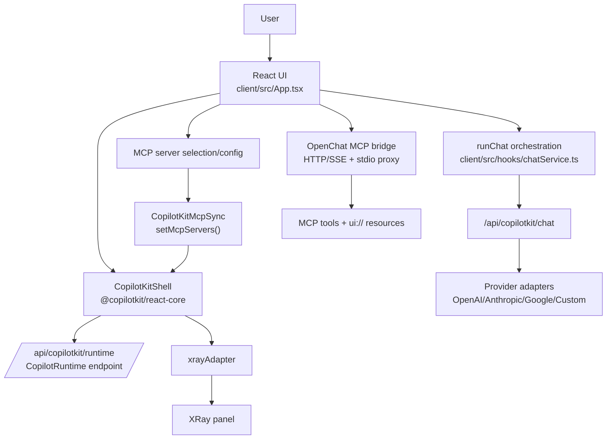
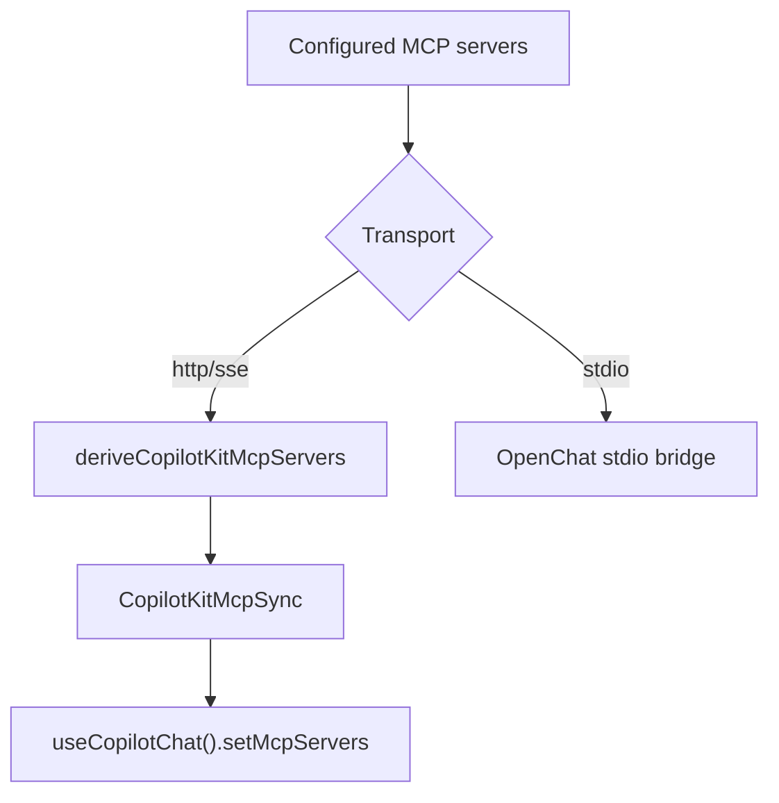
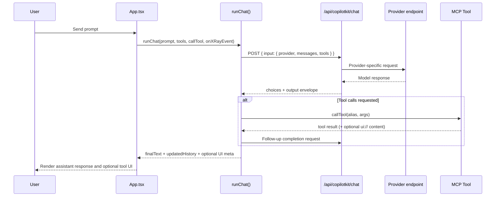

# CopilotKit Integration in OpenChat

This document explains how OpenChat integrates CopilotKit in a desktop-first chat client architecture.
It is intended for engineers evaluating practical CopilotKit usage in a real MCP-enabled application.

https://www.copilotkit.ai/

## Integration goals

OpenChat uses CopilotKit to provide:

- a runtime-backed React integration surface
- MCP server registration into CopilotKit chat context
- consistent runtime event/error handling that feeds OpenChat XRay observability
- a clean contract between the renderer and backend for provider/model execution

## High-level architecture

## Runtime and client wiring

### 1) CopilotKit provider mount

- `client/src/main.tsx` wraps the app in `CopilotKitShell`.
- `client/src/copilotkit/CopilotKitShell.tsx` mounts `<CopilotKit>` with:
  - `runtimeUrl` resolved from `getCopilotKitRuntimeUrl()`
  - `showDevConsole={false}`
  - `onError` hook published into OpenChat’s XRay adapter

### 2) Runtime URL resolution (desktop-safe)

- `client/src/lib/featureFlags.ts` resolves `VITE_COPILOTKIT_RUNTIME_URL`.
- Relative runtime paths are anchored to `getApiBaseUrl()`.
- `client/src/lib/api.ts` resolves desktop API base via preload bridge (`window.openchatDesktop.apiBase`) and falls back to localhost API candidates.

This keeps the runtime URL stable in both browser and Electron `file://` contexts.

## Backend integration surfaces

### 1) CopilotKit runtime endpoint

`server/src/index.ts` initializes:

- `CopilotRuntime`
- `OpenAIAdapter({ model: "gpt-4o-mini" })`
- `copilotRuntimeNodeExpressEndpoint` at `/api/copilotkit/runtime`

That endpoint supports CopilotKit runtime calls and runtime-level coordination.

### 2) CopilotKit chat endpoint

`/api/copilotkit/chat` accepts CopilotKit-compatible input shape and forwards requests to provider adapters.

Key behaviors:

- provider/auth validation via shared schemas
- normalized upstream request construction per provider
- Anthropic/Google response normalization into OpenAI-style `choices[0].message`
- response envelope includes both:
  - `choices` (OpenAI-style)
  - `output.message` and `output.usage` (CopilotKit-compatible output access)

This keeps the frontend orchestration path parse-safe across providers.

## MCP integration pattern

OpenChat separates transport concerns while still integrating with CopilotKit:

- In `App.tsx`, enabled MCP servers are projected into CopilotKit server descriptors (`endpoint`, optional `apiKey`).
- `CopilotKitMcpSync` pushes this projection into CopilotKit using `useCopilotChat().setMcpServers(...)`.
- Projection intentionally includes **HTTP/SSE endpoints** and excludes stdio endpoints from direct CopilotKit registration.
- Stdio tools still run through OpenChat’s desktop-safe backend bridge.

## Chat execution flow

OpenChat’s `runChat(...)` orchestrates the user-visible conversation loop and uses CopilotKit-compatible backend payloads.

## XRay observability with CopilotKit events

OpenChat maps CopilotKit runtime error/telemetry events into the same XRay timeline model used by chat/tool events.

- `client/src/copilotkit/xrayAdapter.ts` converts `CopilotErrorEvent` → `XRayEvent`.
- `CopilotKitShell` publishes runtime events through the adapter.
- `App.tsx` subscribes and appends mapped events into the active XRay turn (or a runtime turn when no active chat turn exists).

This gives one consolidated trace surface for chat orchestration, MCP calls, and runtime-level events.

## Why this integration is valuable

OpenChat gains concrete benefits from CopilotKit:

1. **Standard runtime contract**
   - stable runtime URL and endpoint model for agent/runtime interactions

2. **MCP-aware chat context**
   - dynamic MCP server projection into CopilotKit chat state

3. **Cross-provider consistency**
   - normalized message/usage envelope despite heterogeneous upstream provider APIs

4. **Desktop + web portability**
   - runtime URL resolution and API bridging work in Electron and browser environments

5. **Unified technical transparency**
   - CopilotKit runtime events appear in OpenChat XRay alongside tool/model execution details

## Implementation references

- `client/src/main.tsx`
- `client/src/copilotkit/CopilotKitShell.tsx`
- `client/src/copilotkit/CopilotKitMcpSync.tsx`
- `client/src/copilotkit/xrayAdapter.ts`
- `client/src/hooks/chatService.ts`
- `client/src/App.tsx`
- `client/src/lib/api.ts`
- `client/src/lib/featureFlags.ts`
- `server/src/index.ts`

